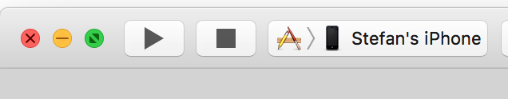
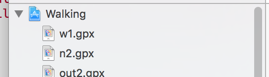

# GPX Movement Faker

This tool allows you to create fake movement paths for xcode with predefined speeds. 

# Installation

1. Install [brew](http://brew.sh/)
1. Run `brew install node`
1. Run `npm install -g https://github.com/stefankendall/gpx-faker.git`

# Xcode Setup

## New Project

1. Open Xcode
1. Create a new project (File > New Project > Single View Application)
1. Build and run the application on your iPhone. You'll need to connect your phone with a lightning cable and select it in xcode here:

1. Congrats! You're now an iOS developer. You should see a white screen. Close the app for now; you'll need to run this any time you want to fake location and movement.

## GPX Files

With the app running, you can fake location with Xcode's `Debug > Simulate Location` command. 

**Don't do that yet**. 

All of the prebuilt locations are static, known, and will get your account banned pretty immediately. We're going to be creating GPX files that xcode can read to set your location and move you around.
 
To add a gpx file to Xcode, drag it from finder into xcode anywhere intothe project. Accept the default options for adding files.

That's it! You can now select your gpx file from `Debug > Simulate Location`

# Creating fake locations and movement

There are currently two ways to create GPX files witht his tool.

## Command Prompt

In any direction, run `gpxfaker`.

Enter a start coordinate:
    
    Start <lat>,<long>:
      
e.g: `35.000111,-77.121233`

Next, we're asked for a command. Hitting `[ENTER]` will choose the default in parentheses. We want to move, so we issue an `m` command.

    Command? (m)ove, (p)ause, (l)oop start or (q)uit:  (m)
   
Now we need a speed.

    Movement speed? (w)alk, (b)ike, or (c)ar:  (w) 
    
"w" for walk is a quick walking speed. This will count as steps, so long as you pause at each location you walk to. 
    
Choose an end location:

    End <lat>,<long>:
      
e.g: `35.000121,-77.123000`   

And then this loops back onto the command entry:

    Command? (m)ove, (p)ause, (l)oop start or (q)uit:  (m)
     
At this point, you should probably pause `p` or quit `q`. If you `quit`, a .gpx file will be written to `./paths/out.gpx`. You can rename this and drag it into xcode.
 
## Google maps directions urls

Needs documentation. e.g. `gpxfaker -g "https://www.google.com/maps/dir/37.2006249,-79.4196146/37.2065041,-79.4168465/@37.1987875,-79.4185417,16z" -s w -l 10 -p`. 
 
# How not to look like you're teleporting across the world

1. If you're going to teleport somewhere, teleport somewhere you could reasonably get to by car. 
1. Always teleport with a target app you're trying to fool force-closed.
1. Switch up the routes. Don't always walk perfect lines. This tool adds randomness to the points you enter, but the same GPX file will always run the same.

# Help

`gpxfaker --help` is the basic command reference. 